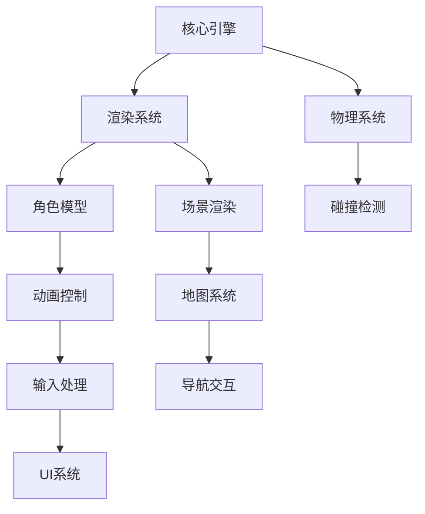
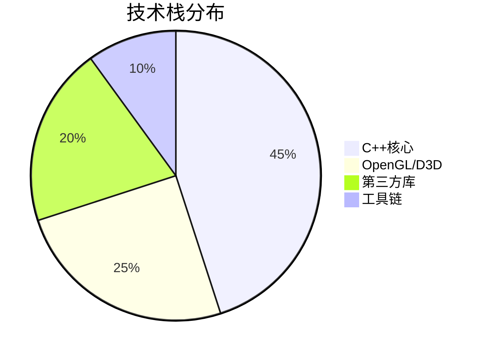
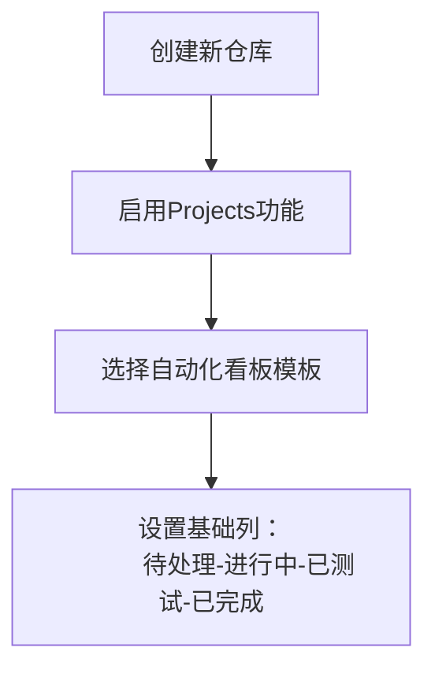

# 华工云交互软件开发分工前瞻

## 🌟 项目愿景
打造华南理工大学国际校区虚拟交互平台，实现：
- 🚶 可自由探索的3D校园场景
- 💬 智能环境交互体验
- 🎓 校园文化特色展示

## 🛠️ 技术架构全景


## 🧑💻 分工详情与推荐选择

### 1. 渲染引擎系统
**核心职责**  
- 开发图形渲染管线
- 实现光影特效
- 性能优化

**推荐人群**  
- 对图形学有强烈兴趣
- 喜欢数学与视觉效果
- 追求极致性能优化

**技能成长**  
📚 OpenGL/D3D | 着色器编程 | GPU优化

---

### 2. 虚拟形象与动画
**核心职责**  
- 角色模型控制
- 骨骼动画实现
- 动作状态机开发

**推荐人群**  
- 喜欢角色扮演类游戏
- 对动作流畅性敏感
- 熟悉3D空间变换

**技能成长**  
📚 骨骼动画原理 | 动画混合 | 逆向运动学

---

### 3. 地图与交互系统
**核心职责**  
- 校园场景管理
- 导航路径规划
- 交互事件处理

**推荐人群**  
- 擅长算法设计
- 熟悉校园布局
- 喜欢逻辑架构

**技能成长**  
📚 A*算法 | 空间分割 | 事件驱动设计

---

### 4. 用户界面系统
**核心职责**  
- 开发交互式GUI
- 管理游戏数据
- 实现对话系统

**推荐人群**  
- 注重用户体验
- 喜欢界面设计
- 细心有条理

**技能成长**  
📚 UI框架开发 | 数据序列化 | 多语言支持

---

### 5. 物理与工具系统
**核心职责**  
- 集成物理引擎
- 开发调试工具
- 维护构建系统

**推荐人群**  
- 喜欢造轮子
- 擅长性能优化
- 工具链爱好者

**技能成长**  
📚 碰撞检测 | 自动化构建 | 性能分析

## 🔍 选择建议指南

| 性格/特长          | 推荐模块               | 亮点体验                 |
|--------------------|------------------------|-------------------------|
| 视觉艺术家         | 渲染系统               | 亲手打造光影世界         |
| 动作游戏迷         | 虚拟形象               | 创造丝滑角色动作         |
| 算法极客           | 地图系统               | 设计智能导航算法         |
| 细节控             | UI系统                | 雕琢完美交互体验         |
| 工具达人           | 物理与工具系统         | 打造高效开发利器         |

## 🚀 开发流程速览

### 协作三原则
1. **接口先行**：提前定义模块交互规范
2. **每日集成**：确保主分支始终可运行
3. **AI助攻**：善用Copilot/Codeium等工具

### 技术栈全景


## 📅 今夜行动建议
1. 阅读各模块详细说明
2. 根据推荐表初步选择意向
3. 在Discord频道提交选择：
   `[选择] 姓名 - 模块 - 理由（1句话）`
4. 领取预学习资料包

## 🛠️ 明日启航准备
- 开发环境配置清单
- C++现代特性速成指南
- GitHub协作流程手册

立即做出你的选择，开启华工云开发之旅！ 🚀


## 分工架构概览
```
技术架构：
├─ 渲染引擎系统（1人）
├─ 虚拟形象与动画（1人）
├─ 地图与交互系统（1人）
├─ 界面与数据系统（1人）
└─ 物理与工具系统（1人）
```

---

## 分工详情说明

### 1. 渲染引擎负责人

#### 职责概述
构建项目的图形渲染核心，负责将3D数据转化为屏幕图像

#### 核心任务
- 实现基础渲染管线（模型加载、材质系统）
- 开发着色器（光照、阴影、后期特效）
- 性能优化（LOD、视锥剔除）

#### 技术要点
```cpp
// 核心接口示例
class Renderer {
public:
    // 提交模型到渲染队列
    // @param model 要渲染的模型对象
    // @param transform 模型的世界变换矩阵
    void submitModel(const Model& model, const Transform& transform);

    // 设置主摄像机视角
    // @param camera 包含位置、朝向等参数的摄像机对象
    void setMainCamera(const Camera& camera);

    // 执行渲染命令（每帧调用）
    // @param deltaTime 距离上一帧的时间间隔（秒）
    void renderFrame(float deltaTime);
};
```

#### 学习资源
- 必修：  
  [LearnOpenGL中文教程](https://learnopengl-cn.github.io/)  
  《OpenGL编程指南（原书第9版）》第1-7章
- 扩展：  
  GAMES101现代计算机图形学课程（B站）

#### 技能要求
- C++面向对象编程
- 线性代数基础
- 图形学兴趣浓厚

#### 协作接口
- 向全体提供模型渲染接口
- 与动画系统对接骨骼着色器
- 接收地图系统的场景数据

---

### 2. 虚拟形象与动画系统

#### 职责概述
实现可操控的虚拟角色及其动画表现

#### 核心任务
- 角色模型导入与渲染
- 骨骼动画系统开发
- 角色控制器实现

#### 技术要点
```cpp
class Character {
public:
    // 播放指定名称的动画
    // @param name 动画资源名称（如"walk","idle"）
    // @param blendTime 动画混合过渡时间（秒）
    void playAnimation(const std::string& name, float blendTime = 0.2f);

    // 更新角色移动状态
    // @param input 包含键盘/手柄输入状态的结构体
    // @param deltaTime 帧时间间隔
    void updateMovement(const InputState& input, float deltaTime);

    // 获取角色当前位置
    // @return 三维坐标向量
    glm::vec3 getPosition() const;
};
```

#### 学习资源
- 必修：  
  [Assimp库官方文档](http://www.assimp.org/)  
  Mixamo动画资源平台
- 扩展：  
  《计算机动画算法与技术》第3-5章

#### 技能要求
- 3D空间理解能力
- 状态机设计经验
- 对角色控制感兴趣

#### 协作接口
- 依赖渲染系统绘制角色
- 向交互系统提供角色位置
- 与物理系统对接碰撞

---

### 3. 地图与交互系统

#### 职责概述
构建虚拟校园环境并管理交互逻辑

#### 核心任务
- 校园地图加载与管理
- 兴趣点(POI)系统开发
- 交互检测与响应

#### 技术要点
```cpp
class CampusMap {
public:
    // 执行射线检测寻找交互对象
    // @param ray 包含起点和方向的射线
    // @return 命中的游戏对象指针（无命中返回nullptr）
    GameObject* raycast(const Ray& ray);

    // 添加兴趣点标记
    // @param poi 包含位置和元数据的兴趣点对象
    void addPOI(const POI& poi);

    // 加载地图数据
    // @param path 地图资源路径
    // @return 是否加载成功
    bool loadMap(const std::string& path);
};
```

#### 学习资源
- 必修：  
  《Game Programming Patterns》观察者模式章节  
  [Recast导航系统文档](https://github.com/recastnavigation/recastnavigation)
- 扩展：  
  QGIS基础教程

#### 技能要求
- 算法设计能力
- 数据组织能力
- 对校园布局熟悉

#### 协作接口
- 向全体提供场景数据
- 与UI系统传递交互信息
- 接收物理系统的碰撞数据

---

### 4. 界面与数据系统

#### 职责概述
管理用户界面和项目资源数据

#### 核心任务
- 实现游戏GUI系统
- 开发资源配置管理器
- 构建对话系统

#### 技术要点
```cpp
class UIManager {
public:
    void showDialogue(const std::string& content);
    void updateHUD(const PlayerState& state);
    //...
};
```

#### 学习资源
- 必修：  
  [Dear ImGui示例代码](https://github.com/ocornut/imgui)  
  JSON for Modern C++库文档
- 扩展：  
  RPG对话系统设计案例

#### 技能要求
- UI/UX设计敏感度
- 数据序列化知识
- 注重细节

#### 协作接口
- 为全体提供资源加载接口
- 从交互系统接收触发事件
- 向渲染系统传递UI元素

---

### 5. 物理与工具系统

#### 职责概述
提供物理支持与开发工具链

#### 核心任务
- 集成物理碰撞系统
- 开发调试工具
- 构建自动化工具链

#### 技术要点
```cpp
class PhysicsEngine {
public:
    RaycastResult rayTest(const Ray& ray);
    void simulate(float deltaTime);
    //...
};
```

#### 学习资源
- 必修：  
  [Bullet物理引擎快速入门](https://pybullet.org/)  
  CMake官方教程
- 扩展：  
  《C++性能优化指南》

#### 技能要求
- 数学物理基础
- 工具开发热情
- 系统优化意识

#### 协作接口
- 向全体提供物理服务
- 为渲染系统提供调试绘制
- 维护项目构建系统

---

## 学习路线建议

### 公共基础（前2周）
1. Git协作流程（每日commit）
2. CMake基础编译（hello world项目）
3. C++现代特性（智能指针/lambda）

### 专项突破（3-5周）
- 渲染组：完成第一个旋转立方体
- 动画组：导入展示角色模型
- 地图组：加载简易场景
- 界面组：实现设置菜单
- 物理组：完成自由落体模拟

---

## 选择建议

根据个人兴趣与技术倾向选择：
- 图形爱好者 → 渲染系统
- 游戏逻辑控 → 动画/地图系统
- 工具达人 → 物理与工具
- 细节控 → 界面系统

建议在本周内完成分工确认，并开始核心技术的预研学习！

该文档可直接保存为`DIVISION_GUIDE.md`供团队参考。建议配合以下工具使用：

1. **腾讯文档**：实时更新分工进展
2. **GitHub Projects**：任务看板管理
3. **Discord频道**：每日进度同步（建议固定晚9点简短汇报）


---

## Github Projects 协作管理方案

### 1. 项目初始化


### 2. 推荐看板结构
```
华工云开发看板
├─ Backlog（需求池）
├─ To Do（待开发）
├─ In Progress（开发中）
├─ Code Review（代码审查）
├─ Testing（测试中）
└─ Done（已完成）
```